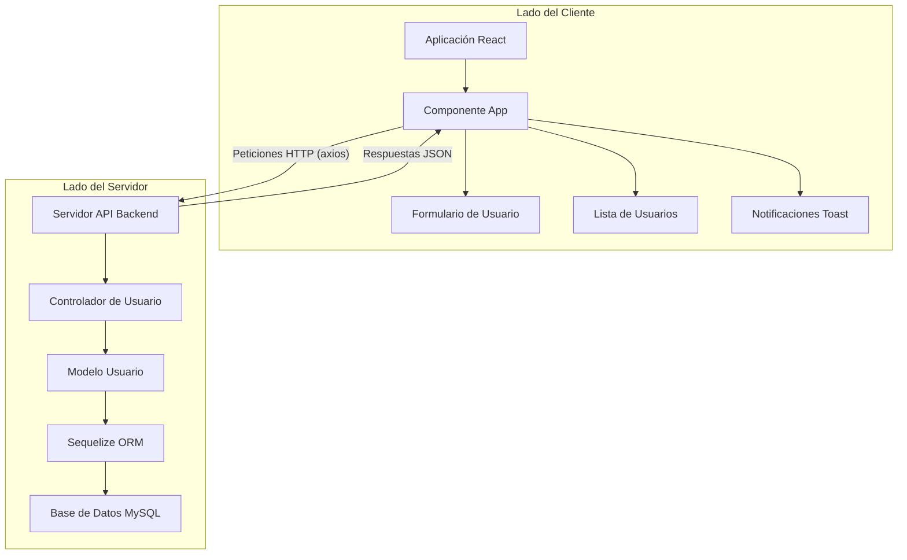
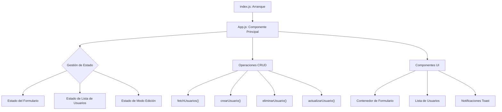
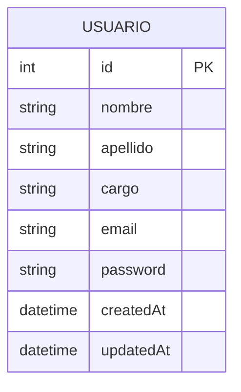
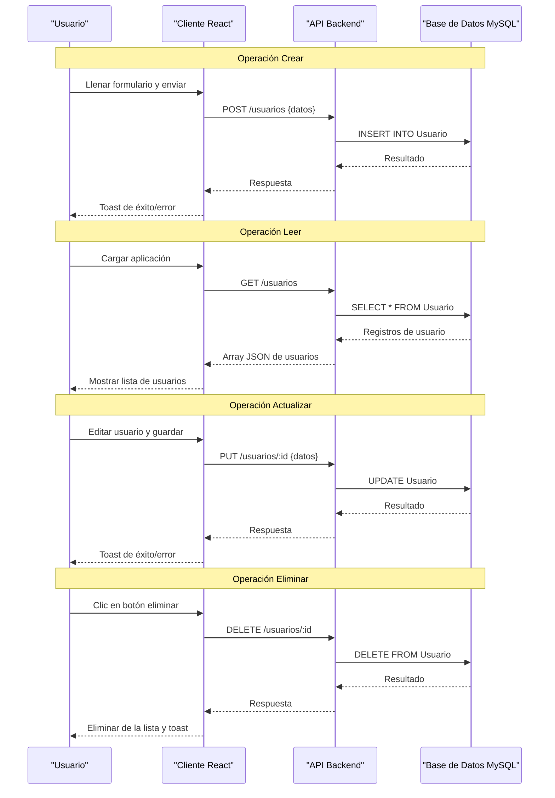

## Propósito y Alcance

CRUD_USUARIOS es una aplicación web full-stack diseñada para demostrar una implementación práctica de funcionalidad de gestión de usuarios. La aplicación permite:

- Crear nuevas cuentas de usuario con nombre, correo electrónico, contraseña y cargo
- Ver una lista de todos los usuarios registrados
- Actualizar información de usuarios existentes
- Eliminar cuentas de usuario

## Arquitectura del Sistema

**Arquitectura de Alto Nivel del Sistema CRUD_USUARIOS**

La arquitectura sigue un modelo cliente-servidor con una clara separación de responsabilidades:

1. **Lado del Cliente**: Una aplicación de página única basada en React que maneja la interfaz de usuario y la lógica del lado del cliente
2. **Lado del Servidor**: Una API backend que procesa solicitudes, interactúa con la base de datos y devuelve respuestas

## Componentes Principales

### Componentes Frontend

El frontend está construido con React y se centra en el componente `App`, que sirve como controlador principal para la interfaz de usuario y la gestión del estado.

### Componentes Backend

El backend utiliza un modelo ORM Sequelize para interactuar con una base de datos MySQL:

## Flujo de Datos

El siguiente diagrama de secuencia ilustra el flujo de datos típico durante las operaciones CRUD:

## Stack Tecnológico

| Componente | Tecnología |
|-----------|------------|
| Frontend | React, Axios, react-hot-toast |
| Backend | Node.js |
| ORM | Sequelize |
| Base de Datos | MySQL |
| Estilizado | CSS con iconos Font Awesome |

## Detalles de Implementación

### Gestión de Estado Frontend

El frontend utiliza el hook useState de React para gestionar el estado de la aplicación incluyendo:

- Lista de usuarios (`usuarios`)
- Estados de entrada del formulario (`nombre`, `email`, `password`, `cargo`)
- Seguimiento del modo de edición (`editando`)
- Datos actuales en edición (`currentData`)

### Comunicación API

El frontend se comunica con el backend a través de cuatro solicitudes HTTP principales implementadas con Axios:

| Operación | Método | Endpoint | Función |
|-----------|--------|----------|----------|
| Crear | POST | `/usuarios` | `crearUsuario()` |
| Leer | GET | `/usuarios` | `fetchUsuarios()` |
| Actualizar | PUT | `/usuarios/:id` | `actualizarUsuario()` |
| Eliminar | DELETE | `/usuarios/:id` | `eliminarUsuario()` |

### Interfaz de Usuario

La aplicación proporciona una interfaz limpia y responsiva con:

- Un formulario para crear y editar usuarios
- Una vista de lista de todos los usuarios con acciones de edición y eliminación
- Notificaciones toast para retroalimentación de operaciones
- Iconos para mejorar la comunicación visual y la experiencia del usuario

## Conclusión

CRUD_USUARIOS es un sistema de gestión de usuarios optimizado que demuestra una implementación efectiva de operaciones CRUD con un frontend React y un backend MySQL. La clara separación de responsabilidades y la arquitectura directa lo convierten en una excelente referencia para comprender el desarrollo de aplicaciones web full-stack.

